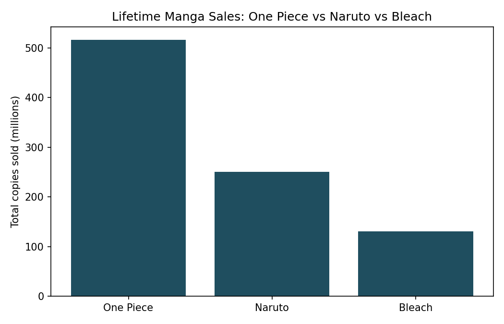
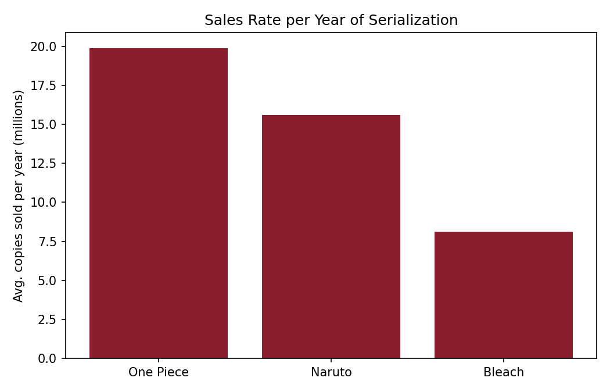

# 📚 Big 3 Manga Sales Analysis

A Python-based data analysis project comparing the reported lifetime manga sales of the **Big 3 Shonen Jump series — One Piece, Naruto, and Bleach**.

The project uses **Pandas** for data processing and **Matplotlib** for visualization. In addition to comparing total lifetime sales, it calculates an approximate **average number of copies sold per year of serialization** to provide a normalized comparison between series with different publication lengths.

---

## 📌 Project Overview

The **Big 3 Manga Sales Analysis** explores sales data for:

* 🏴‍☠️ One Piece
* 🍥 Naruto
* ⚔️ Bleach

The analysis considers two main measurements:

1. **Total lifetime sales**
2. **Average copies sold per year of serialization**

The second metric is calculated by dividing reported lifetime sales by the number of years the series ran.

This provides an additional way to examine sales figures while accounting for differences in serialization length.

---

## 🎯 Objectives

The main objectives of this project are to:

* Analyze manga sales data using Python
* Compare lifetime sales of the Big 3 manga series
* Calculate the serialization period for each series
* Calculate approximate average sales per year
* Sort and compare the series using different metrics
* Create clear visualizations using Matplotlib
* Practice real-world data analysis with Pandas

---

## 🛠️ Technologies Used

| Technology    | Purpose                                            |
| ------------- | -------------------------------------------------- |
| 🐍 Python     | Data analysis and scripting                        |
| 🐼 Pandas     | Data loading, processing, calculations and sorting |
| 📊 Matplotlib | Data visualization                                 |
| 📁 CSV        | Dataset storage                                    |

---

## 📂 Project Structure

```text
Big3MangaSales/
│
├── analyze.py
├── manga_sales_data.csv
├── total_sales.png
├── sales_per_year.png
└── README.md
```

### File Description

**`analyze.py`**

The main Python analysis script. It:

* Loads the manga sales dataset
* Calculates the number of years each manga was serialized
* Calculates average sales per year
* Sorts the data by lifetime sales
* Sorts the data by average yearly sales
* Prints the results in the terminal
* Generates two charts

**`manga_sales_data.csv`**

Contains the manga series, author, start year, end year, and reported copies sold in millions.

**`total_sales.png`**

Visualization comparing the total reported lifetime sales of the three manga series.

**`sales_per_year.png`**

Visualization comparing the approximate average copies sold per year of serialization.

---

## 📊 Dataset

The dataset contains the following columns:

| Column                | Description                         |
| --------------------- | ----------------------------------- |
| `series`              | Manga series name                   |
| `author`              | Manga author                        |
| `start_year`          | Year serialization began            |
| `end_year`            | Year serialization ended            |
| `copies_sold_million` | Reported lifetime sales in millions |

The repository currently contains data for **One Piece, Naruto, and Bleach**.

---

## 🔍 Analysis Methodology

### 1. Load the Dataset

The project reads the CSV file using Pandas:

```python
df = pd.read_csv("manga_sales_data.csv")
```

### 2. Calculate Serialization Period

The number of years each manga ran is calculated using:

```text
Years Running = End Year - Start Year + 1
```

The `+1` includes both the starting and ending years.

### 3. Calculate Average Sales Per Year

The project calculates:

```text
Average Sales Per Year =
Total Copies Sold / Years Running
```

The result is represented in **millions of copies per year**.

The values are rounded to one decimal place.

### 4. Sort the Data

The dataset is sorted by:

* Total lifetime sales
* Average sales per year

This allows the analysis to compare the series using both absolute sales and a simple sales-rate metric.

### 5. Generate Visualizations

The script generates two bar charts:

```text
total_sales.png
sales_per_year.png
```

---

## 📈 Visualizations

### Total Lifetime Sales



This chart compares the reported lifetime copies sold by One Piece, Naruto, and Bleach.

### Average Sales Per Year



This chart compares the approximate average number of copies sold per year during each series' serialization.

---

## 🚀 How to Run the Project

### Prerequisites

Make sure you have:

* Python 3.x
* Pandas
* Matplotlib
* VS Code or another Python IDE

### 1. Clone the Repository

```bash
git clone https://github.com/rehanraza0063-sudo/Big3MangaSales.git
```

### 2. Open the Project

```bash
cd Big3MangaSales
```

### 3. Install Dependencies

```bash
python -m pip install pandas matplotlib
```

### 4. Run the Analysis

```bash
python analyze.py
```

The terminal will display:

* Total lifetime sales
* Average sales per year

The script will also generate:

```text
total_sales.png
sales_per_year.png
```

---

## 🧮 Example Calculation

For each manga, the project uses its start and end years to estimate the serialization period.

For example:

```text
Years Running = End Year - Start Year + 1
```

Then:

```text
Average Sales Per Year =
Copies Sold (millions) / Years Running
```

This is a simple normalization and should not be interpreted as an actual annual sales history.

---

## ⚠️ Data Interpretation

The sales figures are **reported lifetime sales figures**, not a complete year-by-year sales dataset.

The average-sales-per-year metric is therefore an **approximate normalization**, not an actual measure of annual sales performance.

It does not account for:

* Differences in yearly publication volume
* Individual volume releases
* Regional sales differences
* Changes in readership over time
* Digital versus physical sales
* Different market conditions
* Gaps or variations in serialization

The repository's analysis script describes its data as a **2022 snapshot** compiled from publicly reported figures associated with Shueisha/Oricon reporting and aggregated through Kaggle/Databoks.

---

## 📚 Data Source

The dataset is based on publicly reported manga sales figures referenced in the project's analysis script. The repository describes the source as **Shueisha/Oricon-sourced reporting aggregated by Kaggle/Databoks**, using a 2022 snapshot.

---

## 💡 What I Learned

This project helped me practice:

* Python data analysis
* Pandas DataFrames
* CSV data processing
* Creating derived metrics
* Sorting and ranking datasets
* Data normalization
* Matplotlib visualization
* Communicating data through charts
* Interpreting limitations of derived statistics

---

## 🔮 Future Improvements

The project could be extended by adding:

* 📅 Year-by-year sales data
* 📚 Number of manga volumes published
* 🌍 Regional sales comparison
* 💻 Digital vs physical sales
* 📈 Time-series sales visualization
* 📊 Interactive Plotly dashboard
* 🎨 Streamlit web dashboard
* 🔎 Volume-level sales analysis
* 📉 Sales trends over the complete serialization period

A future version could also include additional popular manga series for a broader comparison.

---

## 👨‍💻 Author

**Rehan Raza Shaikh**

Biomedical Engineering Student | Data Analytics | AI/ML | Healthcare Technology

GitHub:
https://github.com/rehanraza0063-sudo

---

## ⭐ Project

This project was created as a practical exercise in **Python-based data analysis and visualization**, using a topic from manga/pop-culture data to explore real-world analytical concepts.

**Built with Python, Pandas & Matplotlib.**
